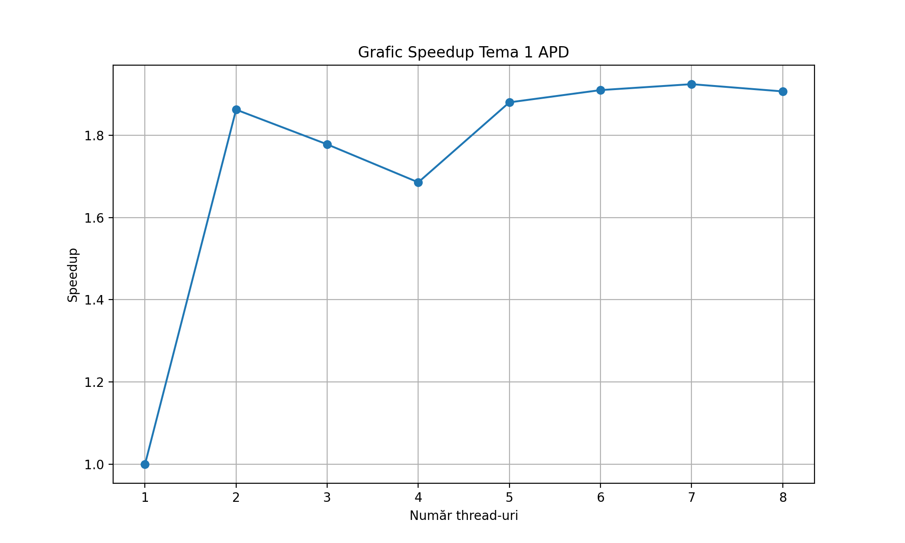
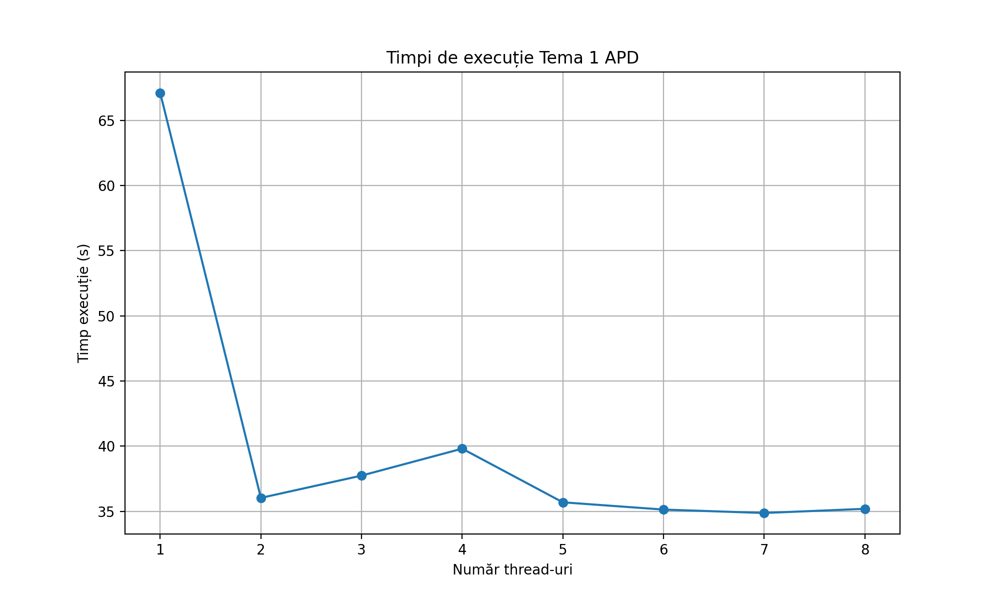

## Secțiunea 1 – Strategia de paralelizare

### Etape de procesare

#### Etapa 1
- Fiecare thread primește un interval disjunct din lista de fișiere JSON.
- Împărțirea se face uniform:
    - `start = id * numberOfFiles / numOfThreads`
    - `end = (id + 1) * numberOfFiles / numOfThreads`
- Fiecare thread citește doar fișierele din segmentul său și aplică deduplicarea.
- Threadurile introduc articolele în `uuidArticlesSelection` și `titleArticlesSelection`.
- Threadurile lucrează independent la citire, sincronizându-se doar în momentul deduplicării.
- După procesare, toate threadurile se opresc la o **barieră** pentru a aștepta finalizarea etapei 1.

#### Etapa 2
- După prima barieră, **thread-ul 0** copiază toate articolele unice într-o listă globală: `Tema1.uniqueArticlesList`.
- După a doua barieră, această listă este împărțită egal între thread-uri, folosind aceeași strategie:
    - `start2 = id * totalUnique / numOfThreads`
    - `end2 = (id + 1) * totalUnique / numOfThreads`
- În această etapă au loc:
    - Clasificarea pe categorii.
    - Clasificarea pe limbi.
    - Procesarea keyword-urilor pentru articolele în limba engleză.
- Toate operațiile sunt independente pentru fiecare articol, astfel încât thread-urile nu mai intră în conflict, concurența fiind gestionată prin structuri thread-safe.
- La final, o ultimă barieră asigură sincronizarea globală înainte de generarea output-urilor finale.

### Descrierea mecanismelor de sincronizare folosite

1. **`Synchronized (deduplicationLock)`**
    - **Folosit exclusiv:** în etapa de deduplicare.
    - **Scop:**
        - Previne inserarea simultană în `uuidArticlesSelection` și `titleArticlesSelection`.
        - Evită verificări inconsistente când două thread-uri procesează articole cu același UUID sau titlu.
        - Elimină condițiile de cursă între inserare și procesare black list.

2. **`ConcurrentHashMap`**
    - **Folosit pentru:**
        - `uuidArticlesSelection`
        - `titleArticlesSelection`
        - `articlesByCategory`
        - `articlesByLanguage`
        - `keywordCounts`
    - **Avantaje:**
        - Permite acces paralel fără blocare globală.
        - Operațiile `computeIfAbsent` sunt thread-safe.
        - Scalabilitate ridicată în etapa 2 (număr mare de operații concurente).

3. **`AtomicInteger`**
    - **Folosit pentru:**
        - `totalArticlesRead` (număr total de articole citite).
        - Counterele de cuvinte (`keywordCounts`).
    - **Avantaje:** Elimină necesitatea unui lock explicit și garantează incrementări atomice.

4. **`CyclicBarrier`**
    - **Folosită pentru a sincroniza etapele:**
        - *Barieră 1:* Thread-urile așteaptă finalizarea etapei de citire/deduplicare.
        - *Barieră 2:* Thread-urile așteaptă generarea listei cu articole unice.
        - *Barieră 3:* Thread-urile așteaptă finalizarea clasificării și numărării keyword-urilor.
    - **Scop:** Asigură că toate fazele se execută în ordine corectă și complet.

### Argumentarea designului
- **Împărțire echilibrată a datelor:** Etapele împart fișierele în segmente egale.
- **Minimizarea secțiunilor critice:** Zona sincronizată este prezentă doar la operația de deduplicare, restul procesării este paralel.
- **Structuri thread-safe optimizate:** `ConcurrentHashMap` și `AtomicInteger` permit paralelism fără blocaje majore.
- **Separarea fazelor:** 2 faze clare (citire+deduplicare vs. procesare unice) evită procesarea inutilă a duplicatelor în etapele costisitoare.
- **Scalabilitate bună:** Clasificarea și numărarea keyword-urilor se realizează paralel cu acces minim sincronizat.
- **Corectitudinea:**
    - Toate threadurile pornesc o singură dată (conform cerinței).
    - Barierele asigură ordinea.
    - Lock-ul garantează consistența la eliminarea duplicatelor.
    - La final au loc sortările, generarea de fișiere și calculele statistice.

---

## Secțiunea 2 - Analiza de performanță și scalabilitate

Pentru analiza de testare am ales setul de date de la **Testul 5** deoarece este voluminos (**13.789 articole**), fiind ușor de observat beneficiile paralelizării.

### Setup de testare
- **CPU:** 11th Gen Intel(R) Core(TM) i7-1165G7 @ 2.80GHz
- **Nuclee:** 4 fizice / 8 logice
- **RAM:** 16 GB
- **OS:** Windows 11
- **Java:** JDK 21
- **Dataset:** 13.789 articole

### Rezultate




| Thread | Rularea 1 (s) | Rularea 2 (s) | Rularea 3 (s) | Average Time (s) | Speedup | Eficiența |
| :---: | :---: | :---: | :---: | :---: | :---: | :---: |
| **1** | 78.91 | 62.82 | 59.55 | **67.09** | 1 | 1 |
| **2** | 36.30 | 36.39 | 35.37 | **36.02** | 1.86 | 0.93 |
| **3** | 30.94 | 34.60 | 47.66 | **37.73** | 1.78 | 0.59 |
| **4** | 43.24 | 37.41 | 38.74 | **39.80** | 1.69 | 0.42 |
| **5** | 34.71 | 36.41 | 35.94 | **35.68** | 1.88 | 0.38 |
| **6** | 36.81 | 35.73 | 32.84 | **35.13** | 1.91 | 0.32 |
| **7** | 33.45 | 36.60 | 34.54 | **34.86** | 1.92 | 0.27 |
| **8** | 34.33 | 35.90 | 35.33 | **35.18** | 1.91 | 0.24 |

### Analiză și concluzii

**Comportamentul observat:**
- **Saltul de performanță:** Cea mai semnificativă îmbunătățire apare la trecerea de la secvențial la 2 fire de execuție (~67s -> ~36s). Speedup-ul de 1.86 este aproape de ideal (2.0), indicând o paralelizare inițială extrem de eficientă.
- **Regresia temporară (3->4 threaduri):** Timpul crește ușor și speedup-ul scade.
- **Stabilizarea (Plafonarea):** Începând cu 5 thread-uri, performanța se îmbunătățește din nou, dar se plafonează rapid în jurul valorii de 35 secunde. Câștigul devine marginal (sub 1 secundă).

**Cauze posibile ale limitărilor:**
- **Blocul synchronized:** Detectarea duplicatelor este un bottleneck (doar un thread poate executa acel bloc la un moment dat).
- **Limitări I/O:** Citirea fizică a fișierelor de pe disc este costisitoare.
- **Hardware:** Sistemul are 4 nuclee fizice și 8 logice, ceea ce explică plafonarea după 4 thread-uri.

**Numărul optim de thread-uri pentru sistem:**
- **Optim general:** **2 thread-uri** (Balans optim între timp ~36s și eficiență 93%).
- **Speedup maxim:** 7 thread-uri.
- **Eficiență maximă:** 2 thread-uri.
```
